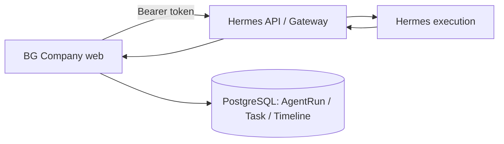
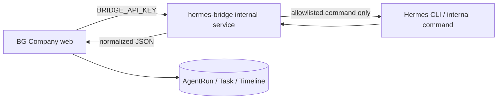

# Hermes Automation Design

## 1. 현재 문제 요약

BG Company Phase 1-C는 콘텐츠 파이프라인에서 `runnerMode=hermes`를 선택할 수 있고, `content-planner` 작업 payload를 Hermes로 보내도록 준비되어 있다.

현재 확인된 상태는 다음과 같다.

- BG Company 운영 도메인: `https://bgcompanyoffice.cloud`
- Hermes Agent 운영 도메인: `https://hermes-agent-8hkq.srv1787289.hstgr.cloud`
- BG Company에서 Hermes 서버까지 HTTP 요청은 도달한다.
- Hermes 자체 웹 대시보드에서는 OpenAI provider와 `gpt-5.4-mini` 모델이 설정되어 있고, 간단한 대화 응답도 확인되었다.
- 그러나 BG Company가 `runnerMode=hermes`로 실행할 때 Hermes가 `unauthenticated`를 반환한다.

즉, 현재 문제는 “Hermes가 동작하지 않는다”가 아니라 “BG Company가 서버 대 서버 방식으로 사용할 수 있는 cookie-free 실행 API가 아직 확인되지 않았다”에 가깝다.

## 2. 실패 원인

현재 VPS에서 확인한 증상은 다음과 같다.

```text
GET /health + Authorization: Bearer <HERMES_API_KEY>
→ 302 /login?next=%2Fhealth

GET /openapi.json
→ 302 /login?next=%2Fopenapi.json

GET /docs
→ 302 /login?next=%2Fdocs

GET /api/health + Authorization: Bearer <HERMES_API_KEY>
→ 401 unauthenticated / reason=no_cookie
```

Hermes 컨테이너에는 `API_SERVER_KEY`가 설정되어 있지만, 현재 노출된 웹 endpoint들은 브라우저 로그인 세션 cookie를 요구하고 있다. `Authorization: Bearer ...` 방식이 통과되는 health/run endpoint는 현재 확인되지 않았다.

따라서 현재 BG Company의 `HERMES_API_KEY`가 잘못되었다기보다, BG Company가 호출하는 endpoint가 “Hermes dashboard 보호 endpoint”일 가능성이 더 높다.

## 3. 공식 API / Gateway 방식 평가

공식 API 또는 Gateway 방식은 가장 깔끔한 1순위 구조다.



### 필요한 조건

아래 조건이 모두 확인되면 공식 API/Gateway 방식을 사용한다.

- cookie 없이 호출 가능한 health endpoint가 있다.
- cookie 없이 호출 가능한 run/session endpoint가 있다.
- `Authorization: Bearer <API_SERVER_KEY>` 또는 동등한 서버 키 인증이 통과된다.
- 요청/응답 payload 형식이 문서화되어 있거나 안정적으로 확인된다.
- web dashboard 로그인 cookie를 사용하지 않아도 된다.
- BG Company web 컨테이너에서 내부 네트워크 또는 안전한 URL로 접근할 수 있다.

### 권장 환경 변수

```env
HERMES_BASE_URL=https://hermes-agent-8hkq.srv1787289.hstgr.cloud
HERMES_API_KEY=<server-to-server token>
HERMES_HEALTH_PATH=/health-or-api-health
HERMES_RUN_PATH=/api/runs-or-supported-run-path
HERMES_TIMEOUT_MS=30000
```

가능하다면 public domain보다 내부 Docker network endpoint를 우선 검토한다.

```env
HERMES_BASE_URL=http://hermes-agent:4860
```

단, Hostinger Docker Manager 프로젝트가 서로 다른 compose project/network에 있으면 별도 네트워크 연결이 필요하다.

### 현재 판단

현재 배포 상태에서는 공식 API/Gateway 방식이 아직 확인되지 않았다. `/health`, `/api/health`, `/openapi.json`, `/docs`가 모두 로그인 cookie를 요구하거나 redirect된다.

그래서 공식 API 방식을 계속 쓰려면 먼저 Hermes 쪽에서 다음을 확인해야 한다.

- API server mode 활성화 방법
- `API_SERVER_KEY`가 실제로 적용되는 endpoint
- server-to-server run endpoint 경로
- dashboard auth와 별개인 gateway endpoint 존재 여부
- Hostinger Hermes 앱에서 API endpoint를 별도 노출하는 설정 여부

## 4. CLI Bridge 방식 평가

공식 API/Gateway가 확인되지 않는다면, 다음으로 현실적인 방식은 내부 전용 Hermes CLI Bridge다.



이 방식은 Hermes 웹 dashboard cookie를 우회하지 않는다. 대신 Hermes가 이미 제공하는 CLI 실행 경로를 내부 서비스가 제한적으로 감싸는 구조다.

### Bridge endpoint 초안

```text
GET  http://hermes-bridge:8787/health
POST http://hermes-bridge:8787/run
```

### 요청 예시

```json
{
  "agentId": "content-planner",
  "taskType": "content_planning",
  "input": {
    "topic": "AI 개인회사 구축 과정 정리",
    "title": "BG Company 구축기 1편",
    "channel": "blog",
    "language": "ko"
  },
  "constraints": {
    "timeoutMs": 60000,
    "maxOutputChars": 12000
  }
}
```

### 성공 응답 예시

```json
{
  "ok": true,
  "provider": "hermes-bridge",
  "agentId": "content-planner",
  "status": "completed",
  "summary": "콘텐츠 기획 초안을 생성했습니다.",
  "content": "...",
  "raw": {
    "stdoutPreview": "...",
    "exitCode": 0
  }
}
```

### 실패 응답 예시

```json
{
  "ok": false,
  "provider": "hermes-bridge",
  "agentId": "content-planner",
  "status": "failed",
  "errorCode": "HERMES_BRIDGE_TIMEOUT",
  "errorMessage": "Hermes command timed out after 60000ms."
}
```

## 5. CLI Bridge 보안 정책

CLI Bridge는 강력한 격리가 필요하다.

필수 정책:

- BG Company web 컨테이너가 Docker socket을 mount하지 않는다.
- BG Company web 컨테이너가 직접 `docker exec`를 실행하지 않는다.
- Bridge는 내부 Docker network에만 노출한다.
- Bridge에는 Traefik public route를 붙이지 않는다.
- Bridge 호출은 `BRIDGE_API_KEY`로 보호한다.
- 사용자 입력을 raw shell command로 넘기지 않는다.
- command allowlist를 둔다.
- timeout을 둔다.
- stdout/stderr 최대 크기를 제한한다.
- 동시 실행 수를 제한한다.
- secret masking을 적용한다.
- 실행 결과는 구조화된 JSON으로 정규화한다.
- 실패해도 BG Company API를 crash시키지 않는다.

권장 환경 변수:

```env
HERMES_BRIDGE_BASE_URL=http://hermes-bridge:8787
HERMES_BRIDGE_API_KEY=<internal-only-token>
HERMES_BRIDGE_TIMEOUT_MS=60000
HERMES_BRIDGE_MAX_OUTPUT_CHARS=12000
HERMES_BRIDGE_MAX_CONCURRENCY=1
```

## 6. 방식 비교

| 방식 | 장점 | 단점 | 현재 적합도 | 판단 |
| --- | --- | --- | --- | --- |
| A. 공식 API/Gateway | 가장 단순하고 운영 친화적. 서버 간 인증이 명확함. | 현재 endpoint와 payload가 확인되지 않음. dashboard auth와 분리 필요. | 조건부 적합 | 가능하면 1순위 |
| B. CLI Bridge | 현재 Hermes CLI 동작을 활용 가능. cookie 없이 내부 자동화 가능. | 별도 bridge 구현/운영 필요. 보안 정책이 중요함. | 현실적 대안 | 공식 API 미확인 시 추천 |
| C. 브라우저 cookie 우회 | 당장 dashboard를 흉내 낼 수 있음. | 취약하고 깨지기 쉬움. 로그인 cookie 저장/재사용 위험. 운영 보안에 부적합. | 부적합 | 금지 |

## 7. 최종 추천

현재 기준 추천은 다음 순서다.

1. Hermes 공식 API/Gateway가 실제로 있는지 한 번 더 확인한다.
2. cookie-free run endpoint와 server token 인증이 확인되면 A안으로 간다.
3. 확인되지 않으면 B안, 즉 내부 전용 Hermes CLI Bridge를 구현한다.
4. C안, 즉 브라우저 cookie 재사용 또는 dashboard 자동 조작 방식은 사용하지 않는다.

현재 관측된 배포 상태만 놓고 보면 B안으로 진행하는 것이 가장 현실적이다.

## 8. 구현 단계 제안

### Phase 1: 확인 / 설계 고정

- Hermes 공식 server-to-server endpoint 재확인
- `API_SERVER_KEY` 적용 endpoint 확인
- 현재 Hostinger Hermes container/network 구조 확인
- BG Company의 `hermes`, `hermes-dry-run` 모드 유지

### Phase 2: Bridge 0차 구현

- `hermes-bridge` 내부 서비스 추가
- `/health`, `/run` endpoint 추가
- `BRIDGE_API_KEY` 인증
- content-planner 전용 allowlist 실행만 지원
- stdout/stderr/result normalize
- timeout/size limit 적용

### Phase 3: BG Company adapter 연결

- `runnerMode=hermes`가 우선 bridge를 호출하도록 전환
- `HERMES_BRIDGE_*` env 추가
- AgentRun metadata에 bridge request/response summary 저장
- Task/Event/Timeline 업데이트는 기존 로직 재사용

### Phase 4: 운영 안정화

- bridge logs 확인 절차 추가
- bridge health check 추가
- 실패 코드 정리
- retry 정책은 나중에 별도 설계
- 동시 실행 제한 및 큐잉 정책 검토

## 9. 운영 / 배포 / 롤백

### 배포

- `docker compose build web hermes-bridge`
- `docker compose up -d web hermes-bridge`
- `bash scripts/check-production-health.sh`
- 콘텐츠 파이프라인 `hermes-dry-run` 확인
- 콘텐츠 파이프라인 `hermes` 소량 테스트

### 롤백

- `runnerMode=mock` 또는 `hermes-dry-run`으로 즉시 우회 가능해야 한다.
- Bridge 장애 시 BG Company 전체 UI/API는 계속 동작해야 한다.
- DB schema 변경 없이 진행하면 rollback 부담이 낮다.

### 금지

- `docker compose down -v` 금지
- 운영 DB 초기화 금지
- web 컨테이너에 Docker socket mount 금지
- public route로 bridge 노출 금지
- browser login cookie 저장/재사용 금지

## 10. 열린 질문

- Hermes 공식 API server mode가 존재하는가?
- `API_SERVER_KEY`가 적용되는 정확한 endpoint는 무엇인가?
- Hermes CLI에서 non-interactive prompt 실행이 안정적으로 가능한가?
- Hostinger Docker Manager에서 `bg-company`와 `hermes-agent`를 같은 internal network에 묶을 수 있는가?
- Bridge가 Hermes container를 직접 호출해야 하는가, 아니면 같은 image/volume을 공유하는 별도 worker로 실행해야 하는가?
- 장기적으로 Agent 실행 결과를 streaming/SSE로 받을 필요가 있는가?

## 11. 이번 문서의 결론

현재 Hermes는 독립 웹 대시보드/CLI로는 정상 동작한다. 하지만 BG Company가 자동 실행용으로 바로 호출할 수 있는 공식 REST API는 현재 배포 상태에서 확인되지 않았다.

따라서 다음 구현 단계는 공식 API endpoint가 확인되면 그 경로로 연결하고, 확인되지 않으면 내부 전용 CLI Bridge를 만든다. 운영 보안상 브라우저 cookie 우회 방식은 사용하지 않는다.
