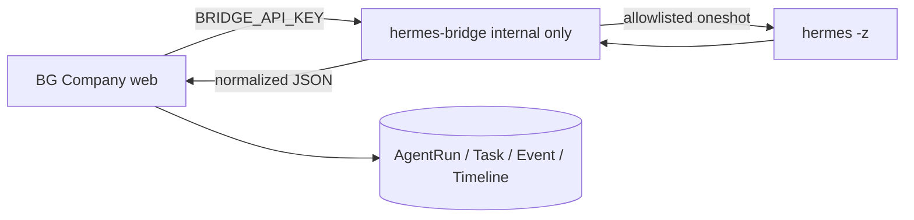

# Hermes Runtime Probe

## 1. 평가 일시와 범위

- 평가 일시: 2026-07-01 KST
- BG Company 운영 도메인: `https://bgcompanyoffice.cloud`
- Hermes Agent 도메인: `https://hermes-agent-8hkq.srv1787289.hstgr.cloud`
- 목적: Hermes 공식 server-to-server API/Gateway 사용 가능 여부와 CLI Bridge 구현 가능성을 최종 평가한다.

이번 문서는 구현 문서가 아니라 런타임 점검 결과 문서다. Bridge 구현, Docker socket mount, cookie 우회, DB schema 변경은 수행하지 않았다.

## 2. BG Company 운영 상태

VPS `/opt/bg-company` 기준 최신 커밋은 다음 상태로 확인했다.

```text
f805f0c docs: design hermes automation bridge
7a9340a feat: prepare hermes content planner integration
5283baf fix: use public health endpoint for web container
78a008f feat: protect dashboard APIs
befd85a feat: add admin login protection
```

컨테이너 상태:

```text
bg-company-web: running / healthy
bg-company-postgres: running / healthy
postgres port: 127.0.0.1:5432
```

운영 health check:

```text
Production health: OK
/api/health: HTTP 200
```

## 3. Hermes 컨테이너 상태

확인된 Hermes 컨테이너:

```text
name: hermes-agent-8hkq-hermes-agent-1
image: ghcr.io/hostinger/hvps-hermes-agent:latest
status: Up
entrypoint: /entrypoint.sh
cmd: []
port: 4860/tcp -> 0.0.0.0:32771
```

중요 환경 변수 존재 여부는 값 없이 `set/not_set`으로만 확인했다.

```text
API_SERVER_KEY=set
OPENAI_API_KEY=not_set
OPENROUTER_API_KEY=not_set
ANTHROPIC_API_KEY=not_set
HERMES_HOME=set
HERMES_WRITE_SAFE_ROOT=set
HERMES_DISABLE_LAZY_INSTALLS=set
HERMES_WEB_DIST=set
HERMES_TUI_DIR=set
PORT=not_set
HOST=not_set
MODEL=not_set
```

주의: Hermes UI에서 OpenAI 모델 응답은 확인되었지만, 컨테이너 환경 변수에는 `OPENAI_API_KEY`가 노출되어 있지 않았다. Hermes가 `/opt/data/.env`, config, OAuth/session 저장소 등 내부 데이터 경로에서 provider 설정을 읽는 구조일 가능성이 있다.

## 4. 공식 API / Gateway endpoint 확인 결과

컨테이너 내부 localhost 기준으로 주요 endpoint를 확인했다.

### 인증 없는 요청

```text
4860 /health        -> 302
4860 /api/health    -> 401
4860 /openapi.json  -> 302
4860 /docs          -> 302
```

다른 후보 포트 `3000`, `8000`, `8080`, `8787`, `5173`은 응답하지 않았다.

### API_SERVER_KEY 인증 후보 헤더 테스트

다음 header 후보를 확인했다.

```text
Authorization: Bearer <API_SERVER_KEY>
x-api-key: <API_SERVER_KEY>
x-server-key: <API_SERVER_KEY>
```

테스트 endpoint:

```text
/api/health
/health
/api/runs
/api/run
/v1/run
/v1/chat/completions
```

결과 요약:

```text
4860 /api/health              -> 401
4860 /health                  -> 302
4860 /api/runs                -> 401
4860 /api/run                 -> 401
4860 /v1/run                  -> 302
4860 /v1/chat/completions     -> 302
```

`bearer`, `x-api-key`, `x-server-key` 모두 동일하게 공식 server-to-server 실행 API로 사용할 수 있는 응답을 주지 않았다.

## 5. 공식 API/Gateway 최종 판단

현재 런타임 기준으로는 공식 API/Gateway를 사용할 수 있다고 판단할 수 없다.

이유:

- `/health`, `/docs`, `/openapi.json`이 login redirect를 반환한다.
- `/api/health`, `/api/runs`, `/api/run`은 API key header 후보를 넣어도 `401`을 반환한다.
- cookie-free run endpoint가 확인되지 않았다.
- OpenAPI 문서도 cookie 없이 접근할 수 없다.

따라서 BG Company가 현재 Hermes dashboard endpoint를 직접 호출하는 방식으로 자동 실행을 붙이는 것은 적절하지 않다.

## 6. CLI/script 확인 결과

Hermes 컨테이너 내부에서 CLI가 확인되었다.

```text
/usr/local/bin/hermes -> /opt/hermes/bin/hermes
Hermes Agent v0.17.0 (2026.6.19)
```

`hermes --help`에서 확인된 핵심 옵션:

```text
-z, --oneshot PROMPT
  One-shot mode: send a single prompt and print ONLY the final response text to stdout.
  Intended for scripts / pipes.
```

이 옵션은 Bridge 구현에 매우 중요하다. 이유는 다음과 같다.

- 비대화형 실행이 가능하다.
- stdout으로 최종 응답만 받을 수 있다.
- script/pipe 용도라고 명시되어 있다.
- BG Company가 결과를 JSON으로 normalize하기 쉽다.

## 7. 실제 content-planner smoke test

아주 작은 비파괴 테스트를 1회 실행했다.

실행 형태:

```text
hermes -z "BG Company content-planner smoke test... Reply in Korean with JSON only..."
```

결과:

```text
EXIT_CODE=0
STDERR: empty
STDOUT: JSON text
```

stdout 예시 요약:

```json
{
  "title": "AI 개인 회사 구축 프로세스 요약(콘텐츠 플래너 스모크 테스트)",
  "summary": "AI 개인 회사를 만들기 위한 핵심 빌드 과정을 단계별로 정리한다..."
}
```

판단:

- 실제 Hermes CLI 실행 가능
- OpenAI 호출 가능
- stdout 결과 수집 가능
- JSON 응답 유도 가능
- BG Company의 content-planner 결과로 normalize 가능

## 8. Bridge 구현 가능성 판단

CLI Bridge 구현은 가능하다고 판단한다.

가능 근거:

- `hermes -z/--oneshot`이 존재한다.
- 실제 smoke test가 exit code 0으로 성공했다.
- stdout에 최종 응답이 반환된다.
- stderr가 비어 있어 정상/실패 분리가 가능하다.
- timeout wrapper 적용이 가능하다.
- content-planner 단일 역할부터 allowlist 방식으로 제한할 수 있다.

불확실하거나 추가 설계가 필요한 부분:

- Hermes 세션/메모리 저장 여부와 장기 실행 시 비용 증가 제어
- stdout이 항상 JSON이 아닐 때의 fallback parser
- timeout 발생 시 Hermes 하위 프로세스 정리 정책
- 동시 실행 제한 방식
- Bridge를 Hermes 컨테이너 내부 실행 wrapper로 둘지, 별도 컨테이너에서 같은 image/volume으로 실행할지

## 9. 추천 아키텍처

공식 API가 확인되지 않았으므로 다음 단계는 내부 전용 Hermes CLI Bridge 구현을 권장한다.



## 10. Bridge 보안 정책

Bridge 구현 시 반드시 지킬 정책:

- BG Company web 컨테이너에 Docker socket을 mount하지 않는다.
- BG Company web에서 직접 `docker exec`를 실행하지 않는다.
- Bridge는 내부 Docker network에만 둔다.
- Bridge에는 Traefik public route를 붙이지 않는다.
- Bridge 호출은 `BRIDGE_API_KEY`로 보호한다.
- 사용자 입력을 raw shell command로 넘기지 않는다.
- command allowlist를 사용한다.
- content-planner부터 단일 역할로 시작한다.
- timeout을 둔다.
- stdout/stderr 최대 크기를 제한한다.
- 동시 실행 수를 제한한다.
- secret masking을 적용한다.
- 실패해도 BG Company API 전체가 crash되지 않게 한다.

## 11. 다음 구현 단계 제안

### Phase 1: Bridge 0차

- `hermes-bridge` 내부 서비스 추가
- `GET /health`
- `POST /run`
- `BRIDGE_API_KEY` 인증
- content-planner allowlist
- `hermes -z` 실행
- timeout/stdout/stderr limit
- JSON normalize

### Phase 2: BG Company 연결

- `runnerMode=hermes`가 공식 API 대신 bridge를 호출하도록 전환
- `HERMES_BRIDGE_BASE_URL`
- `HERMES_BRIDGE_API_KEY`
- `HERMES_BRIDGE_TIMEOUT_MS`
- `AgentRun.metadata`에 bridge summary 저장
- 기존 Task/Event/Timeline 로직 재사용

### Phase 3: 운영 안정화

- bridge health check 추가
- bridge log 확인 문서화
- 실패 코드 체계화
- retry는 초기에는 비활성
- 동시 실행 1개부터 시작

## 12. 최종 결론

현재 Hermes 공식 server-to-server API/Gateway는 확인되지 않았다. 반면 Hermes CLI의 `--oneshot` 실행은 실제로 성공했고 stdout 기반 결과 수집도 가능했다.

따라서 다음 단계는 공식 API를 더 추적하기보다, 보안 정책을 갖춘 내부 전용 Hermes CLI Bridge를 구현하는 것이 가장 현실적이다.

브라우저 login cookie 우회 방식은 계속 금지한다.

## 13. Bridge 0차 후속 구현

런타임 탐지 결과 Hermes CLI `hermes -z`가 실제 응답을 stdout으로 반환하는 것을 확인했다. 따라서 Bridge 0차는 같은 Hermes image를 기반으로 별도 내부 서비스에서 CLI oneshot을 실행한다.

공식 API/Gateway endpoint가 확인되기 전까지 BG Company는 dashboard cookie가 필요한 URL을 호출하지 않는다.
